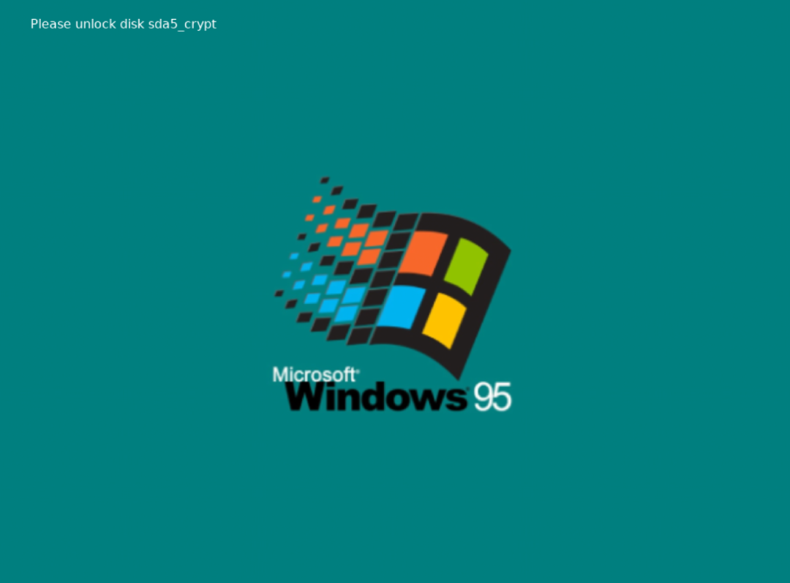

# Debian Splash Screen Customization

A bash script for customizing Debian-based Linux systems' splash screens, including GRUB bootloader background and disk encryption password entry screen.

## Features

- Customize GRUB bootloader background image
- Customize disk encryption password entry screen background
- Configurable password entry bullet/dot image
- Multiple password entry position options
- Adjustable bullet/dot spacing
- Automatic image format conversion (JPEG to PNG)
- Automatic bullet image resizing (max 24px)
- Error handling and dependency checking

## Requirements

- Debian-based Linux system (Debian, Ubuntu, etc.)
- Root/sudo privileges
- Required packages (automatically installed):
  - plymouth
  - imagemagick
  - file

## Installation

```bash
# Clone the repository
git clone https://github.com/bradsec/debcustom.git

# Navigate to directory
cd debcustom

# Make script executable
chmod +x debcustom.sh
```

## Usage

```bash
sudo ./debcustom.sh [-i image_path] [-b bullet_path] [-p position] [-s spacing]
```

### Options

- `-i` : Path to background image (PNG or JPEG)
- `-b` : Path to password dot/bullet image (PNG or JPEG)
- `-p` : Password entry position (see positions below)
- `-s` : Set spacing between password entry bullet images (0.2 - 2.0)
- `-h` : Show help message

### Available Password Entry Positions

- `top-left` (default)
- `top-center`
- `top-right`
- `middle-left`
- `middle-center`
- `middle-right`
- `bottom-left`
- `bottom-center`
- `bottom-right`

### Examples

```bash
# Use all defaults
sudo ./debcustom.sh

# Custom background image
sudo ./debcustom.sh -i /path/to/background.png

# Custom bullet image and position
sudo ./debcustom.sh -b /path/to/bullet.png -p bottom-right

# All custom options
sudo ./debcustom.sh -i background.jpg -b bullet.png -p middle-center -s 0.8
```

## Default Settings

- Background Image: `custom_background.png` in script directory
- Bullet Image: `custom_bullet.png` in script directory
- Password Entry Position: `top-left`
- Bullet Spacing: `1.2`

## Included demo images (replace with your preferred images)

- `custom_background.png`
- `custom_bullet.png`

## Features in Detail

### GRUB Customization
- Sets GRUB timeout to 2 seconds
- Enables quiet splash mode
- Sets custom background image

### Encryption Screen Customization
- Custom background image
- Custom password entry bullet/dot image
- Configurable password entry position with 9 preset positions
- Adjustable bullet spacing for password entry feedback
- Automatic image format conversion and optimization

### Image Processing
- Supports PNG and JPEG formats
- Automatic conversion of JPEG to PNG
- Automatic resizing of bullet images larger than 24px
- Maintains aspect ratio during resizing

## Troubleshooting

1. Make sure the script is run with sudo/root privileges
2. Verify image files exist and are readable
3. Check if system is Debian-based (Ubuntu, Linux Mint, etc.)
4. Ensure internet connection for package installation
5. For GRUB customization, verify GRUB bootloader is installed
6. For encryption screen customization, verify disk encryption is enabled

## Screenshots

### Default Debian 12 GRUB and Encryption Splash Screens 

  
  

### Customized GRUB and Encryption Splash Screens 


  
